<h1 align="center">
			<a href="https://github.com/klauscfhq/hyper-pokemon">
				
			</a>
</h1>

> 🌈👾Wondrous, tailor-made Pokémon themes for your Hyper terminal

 [](https://travis-ci.org/hyper-pokemon/hyper-pokemon) [](https://dependencyci.com/github/hyper-pokemon/hyper-pokemon) [](https://trello.com/b/pg3NWkan) [](https://gitter.im/hyper-pokemon/Lobby) [](https://github.com/hyper-pokemon/hyper-pokemon) [](https://github.com/hyper-pokemon/hyper-pokemon/releases) [](https://github.com/sindresorhus/awesome) [](https://github.com/hyper-pokemon/hyper-pokemon)

## Contents

- [Description](#description)
- [Poll - Choose the next Pokémon Region!](#poll---choose-the-next-pokémon-region)
- [Install](#install)
- [Usage](#usage)
- [Options](#options)
- [Available Themes](#available-themes)
- [Showcase](#showcase)
- [Download](#download)
- [Related](#related)
- [Team](#team)
- [License](#license)

## Description

Made for Pokémon enthusiasts by Pokémon enthusiasts ❤

All of the wonderful Pokémon backgrounds were created by the amazing [Teej/TopHat](https://pldh.net/gallery/the493)!

Come over to our [Gitter](https://gitter.im/hyper-pokemon/Lobby) chat or [Twitter](https://twitter.com/hyper_pokemon) account to share your thoughts on the project or to just say hi!

Track the creation/progress of all themes on our [Trello board](https://trello.com/b/pg3NWkan)!

Inspired by the original [Pokemon-Terminal](https://github.com/LazoCoder/Pokemon-Terminal) project.

## Poll - Choose the next Pokémon Region!

**Vote for the Pokémon Region you want to see themes from next!**<br/>
In essence, this poll will determine the creation order of all Pokémon Regions!<br/>
The poll will be kept alive until the project's completion, when all **600+** themes will be available! :tada:

Trainers make your choice!

[](https://m131jyck4m.execute-api.us-west-2.amazonaws.com/prod/poll/01BMH8W2ETBFXQ9H6PSS0X9VZ8/Johto/vote)
[](https://m131jyck4m.execute-api.us-west-2.amazonaws.com/prod/poll/01BMH8W2ETBFXQ9H6PSS0X9VZ8/Hoenn/vote)
[](https://m131jyck4m.execute-api.us-west-2.amazonaws.com/prod/poll/01BMH8W2ETBFXQ9H6PSS0X9VZ8/Sinnoh/vote)
[](https://m131jyck4m.execute-api.us-west-2.amazonaws.com/prod/poll/01BMH8W2ETBFXQ9H6PSS0X9VZ8/Unova/vote)
[](https://m131jyck4m.execute-api.us-west-2.amazonaws.com/prod/poll/01BMH8W2ETBFXQ9H6PSS0X9VZ8/Kalos/vote)

Poll powered by [tj/gh-polls](https://github.com/tj/gh-polls) ❤

[:arrow_up:Back to top!](#contents)

## Install

### Using the plugin manager - `hpm-cli`

Firstly, ensure you have [Hyper](https://github.com/zeit/hyper/releases) and [Node.js](https://nodejs.org) installed in your system.<br/>
Then simply do the `npm` dance to get `hpm-cli`

```bash
# fire up a terminal and type
$ npm install -g hpm-cli
```

Once done with that, it's time to install the `hyper-pokemon` theme!

```bash
# run the hyper plugin manager
$ hpm install hyper-pokemon
```

### Manually through `.hyper.js`

Add `hyper-pokemon` to the plugins list in your `~/.hyper.js` config file and restart Hyper.
That's it!

```js
plugins: ['hyper-pokemon']
```

[:arrow_up:Back to top!](#contents)

## Usage

Once you have installed `hyper-pokemon`, it's time to set your favorite theme!

Go to your `~/.hyper.js` and add the `pokemon` and `pokemonSyntax` options below the `colors` object, and define your theme of choice!

Here is a quick example, where we choose the `gengar`  theme, with a `unibody` color for the window header & dark terminal tabs!

```js
config: {
    //...
    colors: {
    //...
    },
    pokemon: 'gengar', // Define your favorite pokemon theme!
    pokemonSyntax: 'dark', // Define the color of the terminal tabs!
    unibody: 'true', // Define the color of the Hyper window header!
}
```


To get the exact same look, install Google's [`Roboto Mono`](https://fonts.google.com/specimen/Roboto+Mono) font as well as [`oh-my-zsh`](http://ohmyz.sh/) and choose [`pure`](https://github.com/sindresorhus/pure) as your zsh prompt 🐱

[:arrow_up:Back to top!](#contents)

## Options

### `pokemon`

Using this option you can choose your pokémon background along with it's tailor-made syntax color.

The assignable values are:

- `pokemon name` - choose any of the [available Pokémon themes](#available-themes) by defining the Pokémon name.<br/><br/>**i.e.** `pokemon: 'charizard'`, `pokemon: 'pikachu'`, `pokemon: 'blastoise'` **etc**

- `random` - randomly selects a Pokémon theme from the **whole list** of available Pokémons, each time you fire up a new Hyper terminal session.<br/><br/>
**i.e.** `pokemon: 'random'`

- `pokemon type` - randomly selects a Pokémon theme from only a **specific Pokémon type**, each time you fire up a new Hyper terminal session.<br/><br/>
**i.e.** `pokemon: 'fire'`, `pokemon: 'water'`, `pokemon: 'grass'` **etc**<br/><br/>
The available choices up to this moment (*all types will be supported really soon*) are the following:

	- `fire`
	- `water`
	- `grass`
	- `poison`

### `pokemonSyntax`

Here you can define the color of the terminal tabs.

The assignable values are:

- `light` - choose it if your pokémon theme is of a more light color
- `dark` - go for it if you are using a darker pokémon theme

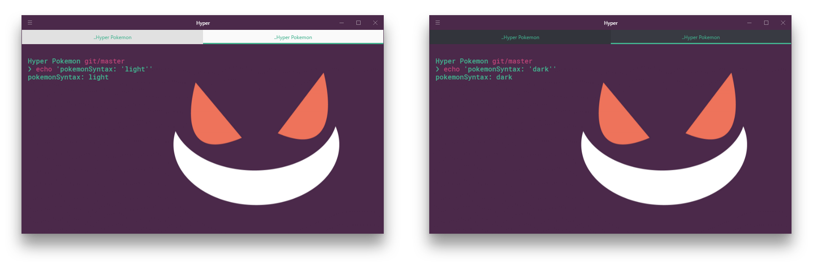

### `unibody`

Choose whether or not you want the Hyper windows header color to be the same as the background pokémon theme.

The assignable values are:

- `true` - choose it for a unibody color theme
- `false` - go for it if you like your terminal more colorful

In addition, completely omitting the `unibody` option from your `.hyper.js` will have the same effect as defining it and setting it to `true`.


[:arrow_up:Back to top!](#contents)

## Available Themes

Here is a list, grouped by Pokémon regions, of all the available Pokémon themes up to now!

<details>
<summary>Kanto Region</summary>

<br/>

> List of all Kanto region Pokémon themes :tada:

 | 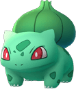 | 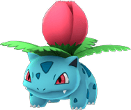 | 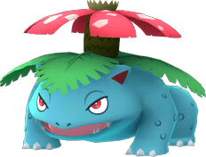 |  | 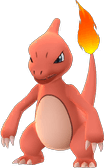 | 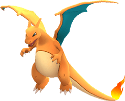 | 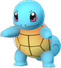
--- | --- | --- | --- | --- | --- | --
Missingno 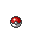 | Bulbasaur  | Ivysaur  | Venusaur 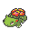 | Charmander 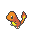 | Charmeleon 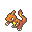 | Charizard 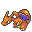 | Squirtle 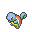

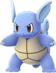 | 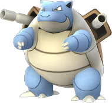 | 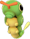 | 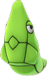 | 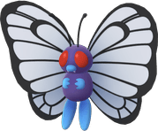 | 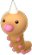 | 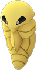 | 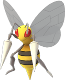
--- | --- | --- | --- | --- | --- | --
Wartortle  | Blastoise 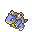 | Caterpie  | Metapod  | Butterfree  | Weedle  | Kakuna 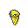 | Beedrill 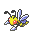

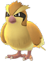 | 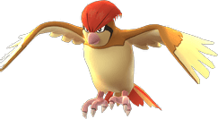 | 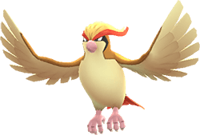 | 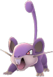 | 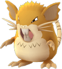 | 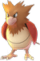 | 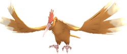 | 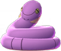
--- | --- | --- | --- | --- | --- | --
Pidgey  | Pidgeotto  | Pidgeot  | Rattata 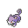 | Raticate 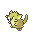 | Spearow 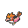 | Fearow  | Ekans 

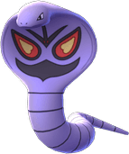 | 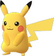 | 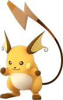 | 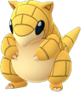 | 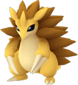 | 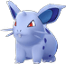 | 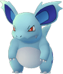 | 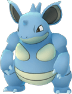
--- | --- | --- | --- | --- | --- | --
Arbok 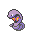 | Pikachu 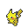 | Raichu  | Sandshrew  | Sandslash  | Nidoran-female  | Nidorina  | Nidoqueen 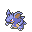

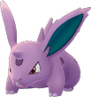 | 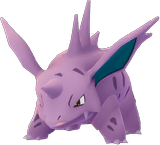 | 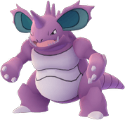 |  | 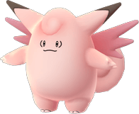 |  |  | 
--- | --- | --- | --- | --- | --- | --
Nidoran-male  | Nidorino  | Nidoking  | Clefairy  | Clefable  | Vulpix  | Ninetales  | Jigglypuff 

 |  |  |  |  |  |  | 
--- | --- | --- | --- | --- | --- | --
Wigglytuff  | Zubat  | Golbat  | Oddish  | Gloom  | Vileplume  | Paras  | Parasect 

 |  |  |  |  |  |  | 
--- | --- | --- | --- | --- | --- | --
Venonat  | Venomoth  | Diglett  | Dugtrio  | Meowth  | Persian  | Psyduck  | olduck 

 |  |  |  |  |  |  | 
--- | --- | --- | --- | --- | --- | --
Mankey  | Primeape  | Growlithe  | Arcanine  | Poliwag  | Poliwhirl  | Poliwrath  | Abra 

 |  |  |  |  |  |  | 
--- | --- | --- | --- | --- | --- | --
Kadabra  | Alakazam  | Machop  | Machoke  | Machamp  | Bellsprout  | Weepinbell  | Victreebel 

 |  |  |  |  |  |  | 
--- | --- | --- | --- | --- | --- | --
Tentacool  | Tentacruel  | Geodude  | Graveler  | Golem  | Ponyta  | Rapidash  | Slowpoke 

 |  |  |  |  |  |  | 
--- | --- | --- | --- | --- | --- | --
Slowbro  | Magnemite  | Magneton  | Farfetchd  | Doduo  | Dodrio  | Seel  | Dewgong 

 |  |  |  |  |  |  | 
--- | --- | --- | --- | --- | --- | --
Grimer  | Muk  | Shellder  | Cloyster  | Gastly  | Haunter  | Gengar  | Onix 

 |  |  |  |  |  |  | 
--- | --- | --- | --- | --- | --- | --
Drowzee  | Hypno  | Krabby  | Kingler  | Voltorb  | Electrode  | Exeggcute  | Exeggutor 

 |  |  |  |  |  |  | 
--- | --- | --- | --- | --- | --- | --
Cubone  | Marowak  | Hitmonlee  | Hitmonchan  | Lickitung  | Koffing  | Weezing  | Rhyhorn 

 |  |  |  |  |  |  | 
--- | --- | --- | --- | --- | --- | --
Rhydon  | Chansey  | Tangela  | Kangaskhan  | Horsea  | Seadra  | Goldeen  | Seaking 

 |  |  |  |  |  |  | 
--- | --- | --- | --- | --- | --- | --
Staryu  | Starmie  | Mr.Mime  | Scyther  | Jynx  | Electabuzz  | Magmar  | Pinsir 

 |  |  |  |  |  |  | 
--- | --- | --- | --- | --- | --- | --
Tauros  | Magikarp  | Gyarados  | Lapras  | Ditto  | Eevee  | Vaporeon  | Jolteon 

 |  |  |  |  |  |  | 
--- | --- | --- | --- | --- | --- | --
Flareon  | Porygon  | Omanyte  | Omastar  | Kabuto  | Kabutops  | Aerodactyl  | Snorlax 

 |  |  |  |  |  |  | 
--- | --- | --- | --- | --- | --- | --
Articuno  | Zapdos  | Moltres  | Dratini  | Dragonair  | Dragonite  | Mewtwo  | Mew 

</details><br/>

[:arrow_up:Back to top!](#contents)

## Showcase

All available themes can be previewed on the project's [homepage](https://hyper-pokemon.github.io)! <br/>
Go on and take a peek 👀

<p align="center">
			<a href="https://github.com/klauscfhq/hyper-pokemon">
				
			</a>
</p>

[:arrow_up:Back to top!](#contents)

## Download

### Fork the project

```bash
# clone the repository
$ git clone https://github.com/klauscfhq/hyper-pokemon.git
# navigate to the project directory
$ cd hyper-pokemon
```

### Using `npm`

```bash
# get the package & set it as a dependency
$ npm install hyper-pokemon --save
# or set it as a devDependency
$ npm install hyper-pokemon --save-dev
# or even save it globally
$ npm install hyper-pokemon -g
```

[:arrow_up:Back to top!](#contents)

## Related

Here is an awesome list where you can find other awesome Hyper themes & plugins!

- [Awesome-Hyper](https://github.com/bnb/awesome-hyper)
- [Pure](https://github.com/sindresorhus/pure)

[:arrow_up:Back to top!](#contents)

## Team

Big up the Athens and London massive.<br/>

[](https://github.com/LoniasGR) | [](https://github.com/pmpakos) | [](https://github.com/georgebax) | [](https://github.com/ThanasisGkanos) | [](https://github.com/tsikos7) | [](https://github.com/klauscfhq) | [](https://github.com/snowmancfhq) | [](https://github.com/SkourasKonst)
--- | --- | --- | --- | --- | --- | --- | ---
[Leonidas Avdelas](https://github.com/LoniasGR) [:mailbox:](mailto:avdelasleonidas@gmail.com) | [Panagiotis Bakos](https://github.com/pmpakos) [:mailbox:](mailto:pmpakos@hotmail.com) | [George Baxopoulos](https://github.com/georgebax) [:mailbox:](mailto:baxopoulos.george@gmail.com) | [Thanasis Gkanos](https://github.com/ThanasisGkanos) [:mailbox:](mailto:athanasiosgkanos@hotmail.com) | [Konstantinos Mitropoulos](https://github.com/tsikos7) [:mailbox:](mailto:konsmitr@gmail.com) | [Klaus Sinani](https://github.com/klauscfhq) [:mailbox:](mailto:klauscfhq@protonmail.com) | [Mario Sinani](https://github.com/snowmancfhq) [:mailbox:](mailto:mariosinani@protonmail.ch) | [Konstantinos Skouras](https://github.com/SkourasKonst) [:mailbox:](mailto:konst.skouras@gmail.com)

[:arrow_up:Back to top!](#contents)

## License

[MIT](https://github.com/klauscfhq/hyper-pokemon/blob/master/license.md)

<div align="center">
	<br>
			<a href="https://github.com/klauscfhq/hyper-pokemon">
				
			</a>
		<br>
	 <p><b> <> with ❤ by the Hyper Pokémon team </b></p>
	<br>
</div>
