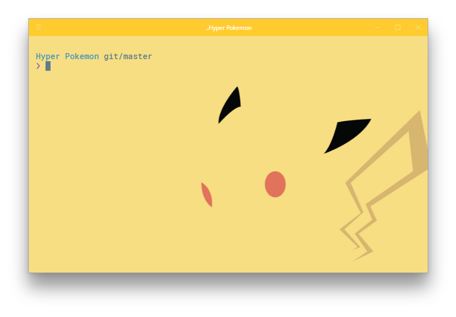
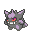
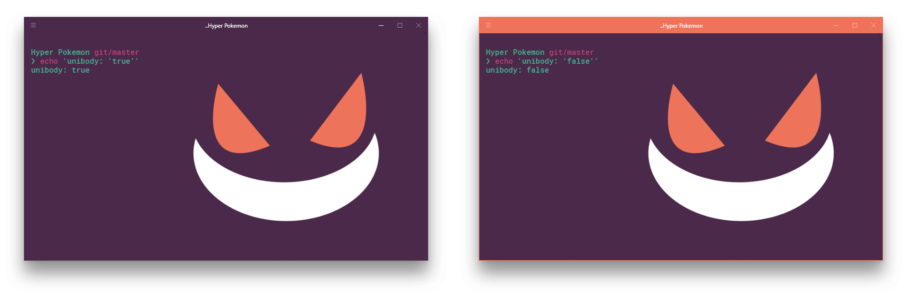

<h1 align="center">
  <br/>Hyper Pokemon
</h1>

<h4 align="center">
  🌈 Tailor-made Pokémon themes for your Hyper terminal
</h4>

<div align="center">
      <a href="https://github.com/klaussinani/hyper-pokemon">
        
      </a>
</div>

<p align="center">
  <a href="https://travis-ci.org/klaussinani/hyper-pokemon">
    
  </a>
  <a href="https://github.com/bnb/awesome-hyper">
    
  </a>
</p>

## Contents

- [Description](#description)
- [Install](#install)
- [Usage](#usage)
- [Options](#options)
- [Available Themes](#available-themes)
- [Related](#related)
- [Team](#team)
- [License](#license)

## Description

Made for Pokémon enthusiasts by Pokémon enthusiasts ❤

All of the wonderful Pokémon backgrounds were created by the amazing [Teej/TopHat](https://pldh.net/gallery/the493), [MapleRose](https://twitter.com/PokeWalls) & [Ferretdayo](http://ferretdayo.github.io).

Come over to [Gitter](https://gitter.im/klaussinani/hyper-pokemon) or [Twitter](https://twitter.com/klaussinani) to share your thoughts on the project.

Visit the [contributing guidelines](https://github.com/klaussinani/hyper-pokemon/blob/master/contributing.md#translating-documentation) to learn more on how to translate this document into more languages.

## Vote the next Region

Vote for the Pokémon Region you want to see themes from next.<br/>
In essence, this poll will determine the creation order of all Pokémon Regions.<br/>
The poll will be kept alive until the project's completion, when all **600+** themes will be available.

[](https://m131jyck4m.execute-api.us-west-2.amazonaws.com/prod/poll/01BMH8W2ETBFXQ9H6PSS0X9VZ8/Johto/vote)
[](https://m131jyck4m.execute-api.us-west-2.amazonaws.com/prod/poll/01BMH8W2ETBFXQ9H6PSS0X9VZ8/Hoenn/vote)
[](https://m131jyck4m.execute-api.us-west-2.amazonaws.com/prod/poll/01BMH8W2ETBFXQ9H6PSS0X9VZ8/Sinnoh/vote)
[](https://m131jyck4m.execute-api.us-west-2.amazonaws.com/prod/poll/01BMH8W2ETBFXQ9H6PSS0X9VZ8/Unova/vote)
[](https://m131jyck4m.execute-api.us-west-2.amazonaws.com/prod/poll/01BMH8W2ETBFXQ9H6PSS0X9VZ8/Kalos/vote)

<sub>Poll powered by [tj/gh-polls](https://github.com/tj/gh-polls)</sub>

## Install

### Hyper Store

Get the theme on the official [Hyper Store](https://hyper.is/plugins/hyper-pokemon).

### Using the plugin manager - `hyper`

Firstly, ensure you have [Hyper](https://github.com/zeit/hyper/releases) installed in your system.

Once done with that, install the `hyper-pokemon` theme.

```bash
# fire up a terminal and type 
$ hyper i hyper-pokemon
```

### Manually through `.hyper.js`

Add `hyper-pokemon` to the plugins list in your `~/.hyper.js` config file and restart Hyper.

```js
plugins: ['hyper-pokemon']
```

## Usage

Once you have installed `hyper-pokemon`, it's time to set your favorite theme.

Go to your `~/.hyper.js` and add the `pokemon` option below the `colors` object, and define your theme of choice.

Here is a quick example, where we choose the `gengar`  theme, with a `unibody` color for the window header & dark terminal tabs.

```js
config: {
    //...
    colors: {
    //...
    },
    pokemon: 'gengar', // Choose your favorite pokemon theme
    unibody: 'true', // Choose the color of the window header
    poketab: 'false', // Deactivate your theme's poketab
    //...
}
```


To get the exact same look, install Google's [`Roboto Mono`](https://fonts.google.com/specimen/Roboto+Mono) font as well as [`oh-my-zsh`](http://ohmyz.sh/) and choose [`pure`](https://github.com/sindresorhus/pure) as your zsh prompt.

## Options

### `pokemon`

Using this option you can choose your pokémon background along with it's tailor-made syntax color.

The assignable values are:

- `pokemon name` - choose any of the [available Pokémon themes](#available-themes) by defining the Pokémon name.<br/><br/>**i.e.** `pokemon: 'charizard'`, `pokemon: 'pikachu'`, `pokemon: 'blastoise'` **etc**<br/><br/>

- `random` - randomly selects a Pokémon theme from the **whole list** of available Pokémons, each time you fire up a new Hyper terminal session.<br/><br/>
**i.e.** `pokemon: 'random'`<br/><br/>

- `pokemon type` - randomly selects a Pokémon theme from only a **specific Pokémon type**, each time you fire up a new Hyper terminal session. You can view all available Pokémon types [here](#available-themes).<br/><br/>
**i.e.** `pokemon: 'fire'`, `pokemon: 'water'`, `pokemon: 'grass'` **etc**<br/><br/>

- `pokemon trainer` - randomly selects a Pokémon theme from only a **specific Pokémon Trainer's party**, each time you fire up a new Hyper terminal session. You can view all available Pokémon Trainer [here](#available-themes).<br/><br/>
**i.e.** `pokemon: 'ash'`, `pokemon: 'jessie'`, `pokemon: 'gary'`, `pokemon: 'erika'` **etc**<br/><br/>

- `pokemon party` - randomly selects a Pokémon theme/theme option from a **defined array** holding **custom multiple themes/theme options**, each time you fire up a new Hyper terminal session. Any from the available Pokémon **themes**, **types** & **trainers** can be chosen.<br/><br/>
**i.e.**
	- `pokemon: ['articuno', 'zapdos', 'moltres', 'mewtwo', 'mew']`
	- `pokemon: ['random', 'fire', 'water', 'grass', 'ash', 'pikachu']`
	- `pokemon: ['lance', 'brock', 'bruno', 'gary', 'legendary', 'dragonite']` **etc**<br/><br/>

### `unibody`

Choose whether or not you want the Hyper windows header color to be the same as the background pokémon theme.

The assignable values are:

- `unibody: 'true'` - choose it for a unibody color theme
- `unibody: 'false'` - go for it if you like your terminal more colorful

In addition, completely omitting the `unibody` option from your `.hyper.js` will have the same effect as defining it and setting it to `true`. (**Default value**)



### `poketab`

Choose whether or not you want an animated `.gif` that matches your current pokemon theme, to accompany your active Hyper terminal tab.

The assignable values are:

- `poketab: 'true'` - enable your theme's poketab
- `poketab: 'false'` - disable your theme's poketab

Also, completely omitting the `poketab` option from your `.hyper.js` will have the same effect as defining it and setting it to `false`. (**Default value**)

<div align="center">
		<br/>
			<a href="">
				
			</a>
		<br/>
		<br/>
</div>

## Available Themes

You can preview in detail all of the available themes [here](https://klaussinani.github.io/hyper-pokemon).

#### Pokémon Types

<details>
<summary>List of all available Pokémon Types.</summary>

<br/>

* `Legendary`
* `Starter`
* `Fire`
* `Water`
* `Grass`
* `Poison`
* `Flying`
* `Bug`
* `Electric`
* `Ground`
* `Fairy`
* `Normal`
* `Psychic`
* `Ghost`
* `Rock`
* `Ice`
* `Dragon`
* `Fighting`
* `Steel`

<br/>

</details><br/>

#### Pokémon Trainers

<details>
<summary>List of all available Pokémon Trainers.</summary>

<br/>

* `Ash`
* `Agatha`
* `Blaine`
* `Brock`
* `Bruno`
* `Erika`
* `Gary`
* `Giovanni`
* `James`
* `Jessie`
* `Koga`
* `Lance`
* `Lorelei`
* `Surge`
* `Misty`
* `Sabrina`

<br/>

</details><br/>

## Related

- [Hyperocean](https://github.com/klaussinani/hyperocean) - Deep oceanic blue Hyper theme. 
- [Hyper Star Wars](https://github.com/klaussinani/hyper-star-wars) - Star Wars themes for your Hyper terminal.
- [Pikachu Syntax](https://atom.io/packages/pikachu-syntax) - Pikachu Atom theme.

## Team

Meet the team and all the [contributors](https://github.com/klaussinani/hyper-pokemon/graphs/contributors).<br/>

- Klaus Sinani [(@klaussinani)](https://github.com/klaussinani)
- Mario Sinani [(@mariocfhq)](https://github.com/mariocfhq)
- Thanasis Gkanos [(@ThanasisGkanos)](https://github.com/ThanasisGkanos)
- George Baxopoulos [(@georgebax)](https://github.com/georgebax)
- Gabriel Tibúrcio [(@tibuurcio)](https://github.com/tibuurcio)

## License

[MIT](https://github.com/klaussinani/hyper-pokemon/blob/master/license.md)
